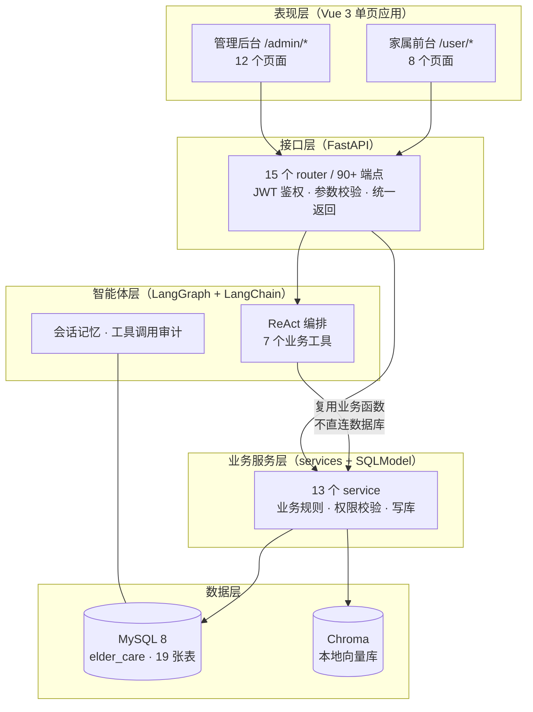
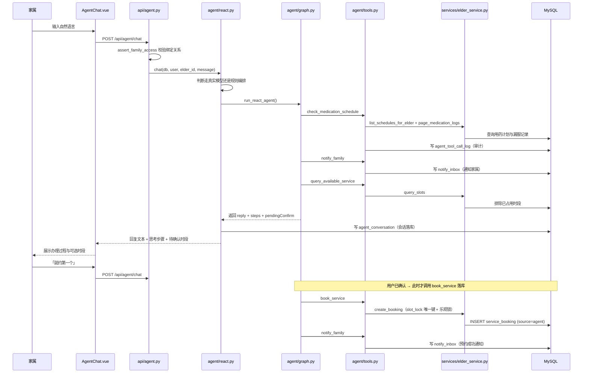
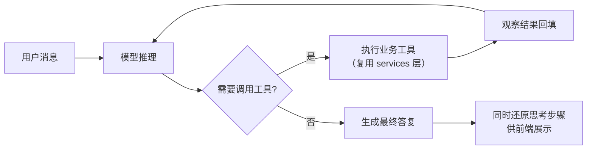
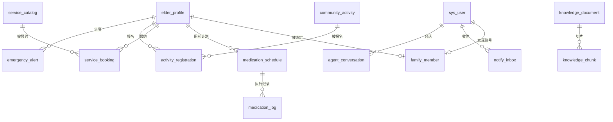

# 适老化社区养老智能助手系统


> 面向社区养老场景的 Web 业务平台：在「老人档案 · 用药管理 · 服务预约 · 社区活动 · 紧急告警 · 站内消息」的完整业务闭环之上，接入一个基于 **LangGraph** 的 ReAct 智能助手。它用自然语言理解需求、自主调用业务工具完成办理，并把「思考—行动—观察」的全过程展示给用户。**工具调用真实读写业务库，过程可解释、结果可复核。**

---

## 目录

- [一、项目简介](#一项目简介)
- [二、功能特性](#二功能特性)
- [三、技术栈](#三技术栈)
- [四、系统架构](#四系统架构)
- [五、项目目录结构](#五项目目录结构)
- [六、快速开始](#六快速开始)
- [七、核心业务流程](#七核心业务流程)
- [八、智能助手设计](#八智能助手设计)
- [九、数据库设计](#九数据库设计)
- [十、接口概览](#十接口概览)
- [十一、核心业务规则](#十一核心业务规则)
- [十二、配置项说明](#十二配置项说明)
- [十三、常见问题 FAQ](#十三常见问题-faq)
- [十四、项目范围](#十四项目范围)
- [十五、安全与隐私提示](#十五安全与隐私提示)
- [十六、配套文档](#十六配套文档)

---

## 一、项目简介

社区养老的日常事务天然是「碎片化 + 代办式」的：子女想确认父母今天吃没吃药、想替父母约一次上门护理、想知道某个补贴政策怎么申请，社区工作人员则要维护档案、排服务时长、处理紧急呼叫。这些事单独看都不复杂，但分散在多个环节里，对不熟悉手机操作的家属和老人而言门槛很高。

本项目把上述事务整合成一个平台，并做了一件关键的事：**让家属可以直接用一句自然语言把事办完**。

例如家属只说一句：

> 我爸老忘吃降压药，这周想约体检

系统会依次：查询用药计划与近期漏服记录 → 向绑定家属发送站内提醒 → 查询未来可预约时段 → **停下来等用户确认时间** → 用户确认后才真正写入预约单 → 再发一条预约成功通知。整个过程在界面上逐步可见，而不是只吐出一段黑箱文字。

### 两套端，两个角色

系统只有一个前端工程，但承载两个完全独立的界面，且**角色互斥**（管理员访问 `/user/*` 会被路由守卫拦到 403，反之亦然）：

| 端 | 路径 | 使用角色 | 面向谁 |
|---|---|---|---|
| **管理后台** | `/admin/*` | `ADMIN` | 平台管理员 / 社区工作人员 |
| **家属前台** | `/user/*` | `USER` | 子女等家属；通过「家属绑定」关联到具体老人 |

老人不单独拆分端侧角色，由家属账号或社区工作人员代为操作。**每位老人只允许绑定一位家属**（数据库唯一约束保证）。

### 设计上的三条主线

1. **智能体不直连数据库。** 它调用的 7 个业务工具全部复用 `services/` 层里已有的业务函数，和前端手工点按钮走的是同一套逻辑、同一套权限校验。因此「助手办的事」和「人工办的事」结果完全一致，只在 `source` 字段上留了 `agent` / `manual` 的标记以便审计。
2. **并发控制不引入 Redis。** 预约防超卖靠「`slot_lock` 唯一键 + `version` 乐观锁」两层数据库手段实现（详见 [11.1](#111-服务预约防超卖)）。
3. **前后台路由策略不同。** 后台菜单存数据库（可在后台动态维护），前台导航写死在代码里（面向老人，需要稳定不变）。

---

## 二、功能特性

### 管理后台（9 大模块）

| 模块 | 能力 |
|---|---|
| 数据概览 | 8 张 KPI 卡片 + 预约状态饼图 + 服务类型柱状图 + 近 7 日预约趋势折线 + 助手工具调用分布 |
| 老人档案 | 老人档案增删改查、家属绑定与解绑、健康档案（慢性病 / 当前用药 / 健康摘要） |
| 用药管理 | 用药计划（药名 / 剂量 / 服药时刻 / 起止日期）、用药记录查询与漏服筛选 |
| 服务预约 | 服务目录维护（体检 / 护理 / 家政）、可约时段管理、预约单状态流转 |
| 社区活动 | 活动发布与下架、报名记录与名额控制 |
| 紧急告警 | 告警工单处理，状态 `open → handling → closed` |
| 知识库 | 文档上传（txt / md / pdf）、自动切片、向量化、切片内容质检 |
| Agent 管理 | 工具说明书（只读目录）、工具调用审计日志（入参 / 返回 / 耗时 / 成败） |
| 系统基座 | 用户管理、菜单动态配置、登录日志、操作日志、文件上传、个人中心 |

### 家属前台（8 个页面）

| 页面 | 路径 | 能力 |
|---|---|---|
| 门户首页 | `/user/home` | 大图标快捷入口、健康提示、**一键紧急求助** |
| 关怀看板 | `/user/care` | 自助绑定 / 解绑老人、漏服与预约摘要 |
| 老人档案 | `/user/elders/:id` | 已绑定老人的档案与健康摘要 |
| 服药打卡 | `/user/medications` | 将用药记录标记为「已服」（幂等） |
| 服务中心 | `/user/bookings` | 手工预约、我的预约记录 |
| 活动天地 | `/user/activities` | 活动浏览、报名与取消 |
| 消息中心 | `/user/notifications` | 站内消息收件箱、未读数、单条 / 全部已读 |
| **智能助手** | `/user/agent` | **AI 对话办理 + 思考步骤可视化 + 待确认预约交互** |

### 智能助手

- **7 类业务工具**：查健康档案、查用药与漏服、查可约时段、提交预约、通知家属、紧急告警、检索知识库（RAG）。
- **两种运行模式**：接入真实大模型走 LangGraph ReAct；未配 Key 或开启演示模式时走内置规则编排，**但工具调用与写库依然真实**。
- **三层记忆**：短时图状态（LangGraph `MemorySaver`）+ 长期会话（MySQL `agent_conversation`）+ 当前老人身份注入上下文。
- **全过程可审计**：每次工具执行写入 `agent_tool_call_log`，管理端可按会话、按工具筛选回看。
- **待确认机制**：涉及写库的操作（如预约）必须先拿到有效信息、再由用户明确确认，禁止擅自落库。

### 适老化设计

- **6 套配色主题**可切换，前台默认柔和绿 + 暖橙，低对比度刺眼元素
- **统一放大的字号与行高**（`styles/front.css` 覆盖），大号圆角按钮（`size="large"`）
- **大图标快捷入口 + 一句话办理**，减少多级菜单跳转
- **降低动效**：`styles/theme.css` 响应 `prefers-reduced-motion`
- 多处 `aria-label` 辅助标签；窄屏自动收起为抽屉菜单

---

## 三、技术栈

| 层次 | 技术选型 | 说明 |
|---|---|---|
| **前端** | Vue 3.4 + Vite 5 + Vue Router 4 + Pinia 2 | 单页应用，管理端与家属端共用一套工程 |
| 前端 UI | Element Plus 2.7 + ECharts 6 + lucide 图标 | 组件库与图表 |
| 前端网络 | Axios | 统一请求 / 响应拦截，自动携带 Token |
| **后端** | Python 3.11+ + FastAPI + Uvicorn | REST API，OpenAPI 文档开箱可用 |
| 后端 ORM | SQLModel 0.0.22（**版本已钉死，见 [13.1](#131-登录或任何写操作报-datetime-values-must-have-timezone-information)**）+ SQLAlchemy 2 | 表定义与数据访问 |
| 参数校验 | Pydantic v2 + pydantic-settings | 出入参校验、配置加载 |
| **鉴权** | PyJWT + passlib + bcrypt 4.0.1 | 无状态 Bearer Token；密码 bcrypt 哈希入库 |
| **数据库** | MySQL 8（`utf8mb4`） | 业务库，库名 `elder_care`，共 19 张表 |
| **智能体编排** | LangGraph（`MemorySaver` checkpointer）+ LangChain | ReAct 状态图、多轮工具调用、短时记忆 |
| 模型对接 | LangChain `ChatOpenAI` 兼容接口 | 默认对接 DeepSeek，可换任意 OpenAI 兼容端点 |
| **RAG** | Chroma（本地持久化）+ MySQL 切片 | 元数据与切片正文入库，向量存本地目录 |
| 文件解析 | pypdf | 知识库 PDF 文档抽文本 |
| 图形验证码 | Pillow | 生成 4 位验证码图，含干扰线与噪点 |

---

## 四、系统架构

### 4.1 逻辑分层



| 层次 | 职责 |
|---|---|
| 表现层 | 页面渲染、路由与权限守卫、状态管理、请求封装 |
| 接口层 | 路由分发、JWT 鉴权、角色校验、参数校验、统一响应格式与异常转换 |
| 业务服务层 | 业务规则、数据权限、事务与写库、并发控制 |
| 智能体层 | ReAct 多轮编排、工具调用、会话记忆、工具日志 |
| 数据层 | 业务数据持久化；向量检索 |

**关键设计**：智能体层与接口层**并列**，都向下依赖业务服务层。智能体无权绕过服务层直接操作数据库，因此权限校验、并发约束、数据隔离对它同样生效。

### 4.2 一次完整请求的链路

以用户说出「我爸老忘吃降压药，这周想约体检」为例：



### 4.3 部署形态

本地单机部署，不引入容器与中间件：

| 组件 | 端口 | 说明 |
|---|---|---|
| MySQL | 3306 | 业务库 |
| 后端 Uvicorn | 8000 | REST API，Swagger 见 `/docs` |
| 前端 Vite dev server | 5173 | 将 `/api`、`/uploads` 代理到后端 8000 |
| Chroma | — | 本地目录持久化，无独立服务 |

---

## 五、项目目录结构

```
elder-care/
├── fastapi/                    # 后端工程（源码在 app/ 下）
│   ├── app/
│   │   ├── main.py             # 程序入口：建应用、CORS、异常处理器、挂载路由与静态目录
│   │   ├── api/                # 接口层：15 个 router，90+ 端点
│   │   ├── services/           # 业务服务层：13 个 service，真正的业务逻辑
│   │   ├── models/             # 数据层：19 张表的 SQLModel 映射
│   │   ├── schemas/            # 出入参模型（VO / CreateRequest / UpdateRequest / QueryRequest）
│   │   ├── agent/              # 智能体层：LangGraph ReAct 编排 + 7 个业务工具
│   │   ├── core/               # 配置中心、JWT 与密码、依赖注入与鉴权
│   │   ├── common/             # 统一响应、业务异常、校验中文翻译、路径白名单
│   │   └── db/                 # 数据库引擎与会话
│   ├── data/knowledge_seed/    # 知识库种子语料（9 篇中文 txt）
│   ├── .env.example            # 环境变量模板（复制为 .env 后修改）
│   ├── requirements.txt        # Python 依赖
│   └── dev.bat                 # 一键装依赖 + 启动后端（Windows）
│
├── vue/                        # 前端工程（Vue3 + Vite）
│   └── src/
│       ├── main.js             # 启动入口：主题 → Pinia → Router → 指令 → Element Plus
│       ├── App.vue             # 根组件（仅 router-view）
│       ├── router/             # 静态路由 + 动态菜单注入 + 全局权限守卫
│       ├── api/                # 16 个接口封装文件，逐一对应后端模块
│       ├── store/              # Pinia：登录态、多页签
│       ├── plugins/            # Pinia 持久化插件（写 localStorage）
│       ├── layout/             # 两套布局：AdminLayout / FrontLayout
│       ├── views/              # 25 个页面（admin / front / user / log / menu / profile / error）
│       ├── components/         # 复用组件（头像、主题切换、助手思考步骤、图标选择等）
│       ├── config/             # 站点信息、前台导航配置
│       ├── directives/         # 自定义指令 v-auth（按钮级权限）
│       ├── utils/              # 请求封装、路由工具、主题、格式化等
│       ├── styles/             # 主题变量、后台通用样式、前台适老化样式
│       └── assets/             # 图片资源
│
├── sql/
│   └── system.sql              # 全量数据库脚本：建库 + 19 张表 + 演示种子数据
│
└── docs/                       # 配套设计文档
```

### 后端目录职责速查

| 目录 | 职责 |
|---|---|
| `app/api/` | **薄壳**，只做参数接收与转发，不含业务逻辑。统一挂载在 `/api` 前缀下 |
| `app/services/` | **项目主干**。`elder_service.py` 单文件最大，承载档案/家属/用药/预约四条主线；`knowledge_service.py` 负责 RAG；`vector_store.py` 封装 Chroma |
| `app/models/` | `__init__.py` 定义 5 张系统表，`elder.py` 定义 14 张业务表 |
| `app/agent/` | `graph.py` 编排、`react.py` 入口与降级、`tools.py` 工具实现与埋点、`tool_catalog.py` 工具说明书、`memory.py` 长期记忆、`observation_format.py` 返回值「说人话」 |
| `app/core/` | `config.py` 配置、`security.py` 密码与令牌、`deps.py` 依赖注入 + `require_admin` + 操作日志装饰器 |
| `app/common/` | `result.py` 统一响应（自动转驼峰）、`exceptions.py` 业务异常、`validation.py` 报错中文化、`menu_paths.py` 菜单路径白名单 |
| `fastapi/data/knowledge_seed/` | RAG 初始语料，被 `sql/system.sql` 作为种子数据收入 `knowledge_document` / `knowledge_chunk` |

### 前端目录职责速查

| 目录 | 职责 |
|---|---|
| `src/router/` | `index.js` 守卫、`routeMap.js` 路径 ↔ 组件登记表、`dynamicRoutes.js` 按角色动态生成路由 |
| `src/views/front/` | 家属前台 8 个页面，**智能助手在 `AgentChat.vue`** |
| `src/views/admin/` | 管理后台 9 个页面 |
| `src/layout/` | `AdminLayout`（侧栏 + 页签 + keep-alive）、`FrontLayout`（顶栏 + 消息铃 + 移动端抽屉） |
| `src/utils/request.js` | **前后端通信枢纽**：Token 注入、统一剥壳、401 自动登出 |
| `src/utils/agentTools.js` | 把工具名与参数翻译成中文，配合助手页面展示 |
| `src/styles/front.css` | **适老化样式落点**：大字号、大行高、柔和配色 |

---

## 六、快速开始

### 6.1 环境要求

| 软件 | 版本要求 | 用途 |
|---|---|---|
| Python | 3.11+（3.12 / 3.13 均可） | 运行后端 |
| Node.js | 18 LTS / 20 LTS（实测 24 亦可） | 构建前端 |
| MySQL | 8.0+ | 业务数据库 |

无需 Redis、无需 Docker、无需任何外部大模型 Key 即可完整运行（默认走演示模式）。

### 6.2 第一步：导入数据库

`sql/system.sql` 是**全量终态脚本**，包含建库、19 张表、索引、约束与演示种子数据，一次执行即可，无需再跑增量脚本。脚本幂等（先 `DROP TABLE IF EXISTS` 再建），可反复导入。

```bash
mysql -u root -p --default-character-set=utf8mb4 < sql/system.sql
```

> **Windows PowerShell 用户注意**：PowerShell **不支持 `<` 输入重定向**，直接执行会报语法错误。请改用以下任一方式：
>
> ```powershell
> # 方式一：交给 cmd 执行重定向
> cmd /c 'mysql -u root -p --default-character-set=utf8mb4 < sql/system.sql'
>
> # 方式二：用 mysql 客户端自身的 source 命令
> mysql -u root -p --default-character-set=utf8mb4 -e "source sql/system.sql"
> ```
>
> 也**不要**用 `Get-Content system.sql | mysql ...` 这种管道写法——中文 Windows 控制台默认 GBK，会把中文种子数据转成乱码。

导入成功后验证：

```bash
mysql -u root -p -e "SHOW TABLES FROM elder_care;"
```

应输出 **19 张表**。

### 6.3 第二步：配置环境变量

```bash
cd fastapi
cp .env.example .env        # Windows: copy .env.example .env
```

然后编辑 `fastapi/.env`，**至少修改数据库密码**：

```ini
DB_PASSWORD=你的MySQL密码
```

其他项保持默认即可运行。几个要点：

- **`AGENT_DEMO_MODE=true`（默认）**：无需大模型 Key 即可演示，智能助手走内置规则编排，**但工具调用与数据库写入都是真实的**。
- 若要接入真实大模型：将 `AGENT_DEMO_MODE` 改为 `false`，并填写 `LLM_API_KEY`。
- `.env` 已在 `.gitignore` 中，**不会被提交**；请勿手动将其加入版本控制。

### 6.4 第三步：启动后端

```bash
cd fastapi
python -m venv .venv
# Windows
.venv\Scripts\python.exe -m pip install -r requirements.txt
# macOS / Linux
# .venv/bin/python -m pip install -r requirements.txt
```

启动：

```bash
# Windows
.venv\Scripts\python.exe -m uvicorn app.main:app --reload --host 127.0.0.1 --port 8000
# macOS / Linux
# .venv/bin/python -m uvicorn app.main:app --reload --host 127.0.0.1 --port 8000
```

Windows 下也可直接运行 `dev.bat`（会自动安装依赖后再启动）。

看到以下输出即成功，界面可访问 **http://127.0.0.1:8000/docs** 查看 Swagger：

```
INFO:     Application startup complete.
INFO:     Uvicorn running on http://127.0.0.1:8000 (Press CTRL+C to quit)
```

> ⚠️ **必须在 `fastapi` 目录下启动**。`.env`、`UPLOAD_PATH=./uploads`、`CHROMA_PATH=./data/chroma` 都是相对当前工作目录的路径，从仓库根目录启动会读不到配置。

### 6.5 第四步：启动前端

另开一个终端：

```bash
cd vue
npm install
npm run dev
```

看到 `ready in ... ms` 与 `Local: http://localhost:5173/` 即成功。Vite 已配置把 `/api` 与 `/uploads` 代理到后端 8000 端口，因此不存在跨域问题。

### 6.6 第五步：登录

浏览器访问 **http://localhost:5173/**

登录需要填写**图形验证码**（4 位，带干扰线；5 分钟有效、一次性使用）。

### 6.7 演示账号

以下账号由种子数据预置，**仅供本地演示**：

| 账号 | 密码 | 角色 | 登录后进入 | 绑定关系 |
|---|---|---|---|---|
| `admin` | `admin` | `ADMIN` | 管理后台 `/admin/dashboard` | — |
| `aaa` | `123` | `USER` | 家属前台 `/user/home` | 张建国（儿子，主家属） |
| `bbb` ~ `ggg` | `123` | `USER` | 家属前台 | 各自绑定一位演示老人 |

> **注意**：管理员与家属端**角色互斥**。用 `admin` 登录无法进入 `/user/*`（会被路由守卫拦到 `/admin/403`），想体验智能助手**必须用家属账号登录**。
>
> 生产环境请务必删除或修改这些演示账号。

### 6.8 想看智能助手，请按这个顺序操作

1. 用 `aaa` / `123` 登录（不是 admin）
2. 顶栏点「智能助手」，进入 `/user/agent`
3. 发送：**`我爸老忘吃降压药，这周想约体检`**
4. 界面会返回可用时段并等待你确认，回复 **`就约第一个`**
5. 此时才真正落库预约，并发送预约成功通知

验证它真的写库了：

- 前台顶栏**消息铃铛** → 收到用药提醒与预约成功通知
- 前台「**服务中心**」→ 看到助手下的预约，备注为「智能助手预约」
- 换 `admin` 登录后台 → 「**服务预约**」里该单 `source=agent`；「**Agent 日志**」里能看到每一次工具调用的入参与耗时

---

## 七、核心业务流程

系统由四条业务闭环构成，智能助手的能力就是这些闭环的「自然语言入口」。

### 7.1 服务预约闭环（含并发控制）

```
家属/助手选择服务 → 查询可约时段 → 确认时间 → 创建预约（占用时段）
   → 通知家属 → 社区完成服务 / 家属取消（释放时段）
```

- 可约时段由服务层按未来若干天动态生成（默认每日 `09:00`、`14:00`），**仅排除状态为 `pending`、`confirmed` 的占用**；`cancelled`、`done` 释放出的时段可再次预约。
- 创建入口有三个：前台手工预约、管理端维护、助手工具 `book_service`（写入时 `source=agent`）。
- **助手必须在拿到用户明确确认后才允许落库**，禁止擅自挑选时间。
- 并发防超卖机制详见 [11.1](#111-服务预约防超卖)。

### 7.2 用药与漏服提醒闭环

```
管理端维护用药计划（药名 + 服药时刻）
   → 系统按计划生成用药执行记录（medication_log）
   → 家属在「服药打卡」标记已服 / 记录随时间转为漏服
   → 看板与健康摘要统计漏服 → 助手发现漏服后通知家属
```

- 漏服判定来源是 `medication_log` 中 `status=0` 的记录，**不是实时传感器**，以系统打卡数据为准。
- **助手工具 `check_medication_schedule` 是只读的**，它不改写打卡状态。标记「已服」必须走前台打卡接口——这是一条刻意的权限边界。
- 规则编排下发现漏服后，通常继续调用 `notify_family`，消息类型为 `medication`。

### 7.3 紧急告警闭环

```
老人/家属一键求助 或 助手识别紧急意图
   → 写入 emergency_alert（默认 status=open，标记已通知家属与工作人员）
   → 同步向绑定家属写站内消息（msg_type=emergency）
   → 管理端将状态流转为 handling → closed
```

- 即使该老人**没有绑定家属**，告警工单依然保留，供社区侧处理。
- 助手仅在明确紧急意图（跌倒、胸痛、昏迷、明确求救）时才调用 `trigger_emergency_alert`，且必须在文案中提示用户必要时拨打 120，**本工具不能替代急救**。

### 7.4 社区活动闭环

```
管理端发布活动（标题 / 内容 / 地点 / 起止时间 / 名额 / 上架状态）
   → 家属为已绑定老人报名 → 名额与重复报名校验 → 取消报名（状态改为 cancelled）
```

- 名额仅统计 `status='registered'` 的记录；`capacity` 为空表示不限。
- 同一老人同一活动受唯一约束限制；取消后可再次报名恢复为 `registered`。
- 删除活动前先清理报名记录。

---

## 八、智能助手设计

这是本项目的核心，也是与其他 CRUD 项目拉开差距的地方。

### 8.1 编排原理

采用 **LangGraph** 实现 **ReAct（Reasoning + Acting）** 循环：模型产出工具调用 → 系统执行业务工具 → 将观察结果回填消息 → 模型继续推理 → 直至给出最终答复。整轮过程的 `recursion_limit` 设为 12，避免异常情况下无限循环。

配套使用 LangChain 的 `ChatOpenAI` 对接 OpenAI 兼容接口（默认 DeepSeek），工具以 `StructuredTool` + Pydantic 入参 schema 声明，由模型自主决定调用顺序与参数。



### 8.2 两种运行模式

| 模式 | 触发条件 | 行为 |
|---|---|---|
| **模型编排** | 已配置有效 `LLM_API_KEY` 且 `AGENT_DEMO_MODE=false` | Function Calling + LangGraph ReAct，由模型自主编排 |
| **规则编排（默认）** | 未配置 Key，或 `AGENT_DEMO_MODE=true` | 按内置关键词规则选择工具；**仍然真实调用业务工具并写库** |
| **异常回退** | 模型调用抛异常 | 自动降级为规则编排，向用户返回「已切换为本地助手继续办理」，保证业务链路不中断 |

无论哪种模式，接口返回体里都会带 `engine`（`langgraph` / `demo`）与 `demoMode` 字段，便于排查当前实际走的是哪条路径。

### 8.3 三层记忆机制

| 层次 | 载体 | 作用 |
|---|---|---|
| 当前身份 | 消息前缀注入 | 把「当前老人 ID」注入上下文，工具缺省 `elder_id` 时可自动补全 |
| 短时记忆 | LangGraph `MemorySaver`（按 `thread_id = u{用户ID}:{会话ID}`） | 保留单会话内的图状态，支持多轮工具链 |
| 长期记忆 | MySQL `agent_conversation` 表 | 会话落库，服务重启后历史不丢；每轮最多注入最近 20 条历史消息，控制上下文长度 |

### 8.4 七个业务工具

| 工具名 | 功能 | 副作用 | 权限要点 |
|---|---|---|---|
| `query_health_record` | 查健康档案（慢性病、用药摘要、近期漏服概况） | 只读 | 仅能查询已绑定老人 |
| `check_medication_schedule` | 查用药计划与漏服记录 | 只读 | 同上；**不改写打卡状态** |
| `query_available_service` | 按类型查可约时段 | 只读 | 登录用户 |
| `book_service` | 为老人提交预约（`source=agent`） | **写库** | 须已绑定；防超卖；**须用户确认** |
| `notify_family` | 向绑定家属写站内消息 | **写库** | 无绑定时通知数为 0 |
| `trigger_emergency_alert` | 创建紧急告警并通知家属 | **写库** | 须已绑定；无家属也保留工单 |
| `query_knowledge_base` | RAG 检索政策 / 用药 / 服务知识片段 | 只读 | 登录用户 |

> 完整的工具说明书（用途、入参、使用规则、示例问法）由 `agent/tool_catalog.py` 提供，并可在管理后台「**Agent 工具**」页面在线查看。

### 8.5 待确认预约机制

这是防止助手「自作主张」的关键设计：

1. `query_available_service` 返回时段后，系统把「待确认预约上下文」（服务目录、可选时段列表）写入会话（`agent_conversation` 中 `role=pending_book` 的记录，进程内另有缓存），并通过接口的 `pendingConfirm` 字段返回给前端。
2. 前端据此渲染**可点击的时段选项**。
3. 用户明确选定时间后，才调用 `book_service` 真正落库。
4. 预约失败（时段被占、服务下架等）时**保留待确认状态**，提示更换时段；成功后清除。

### 8.6 过程可视化

后端从 LangGraph 的消息轨迹中**还原出「思考—行动—观察」步骤序列**（`graph.py` 的 `_extract_steps`），逐条返回给前端，由 `AgentThoughtSteps.vue` 渲染成办理过程。工具返回的原始 JSON 会被 `observation_format.py` 统一翻译成面向用户的中文摘要（例如「已预约「体检套餐」；服务对象：张建国；时间：…；状态：待确认」），**绝不直接把 JSON 展示给用户**。

### 8.7 可复制的演示脚本

规则编排模式下按关键词触发，推荐按以下顺序对话：

| 轮次 | 你说的话 | 预期结果 |
|---|---|---|
| 1 | `我爸老忘吃降压药，这周想约体检` | 查用药与漏服 → 通知家属 → 查可约时段，返回待确认时段 |
| 2 | `就约第一个`（或直接说 `约 09:00 那个`） | 真正落库预约，并发送预约成功通知 |
| 3 | `居家养老补贴怎么申请` | RAG 检索知识库，基于检索片段回答 |
| 4 | `老人摔倒了，快帮忙` | 创建紧急告警工单并通知家属（**会真实写入数据**） |

其他可用的触发词参考：

- **用药类**：`药`、`漏服`、`忘记吃`、`降压`
- **预约类**：`体检`、`约`、`护理`、`家政`
- **知识类**：`补贴`、`政策`、`知识`、`怎么吃`、`能否`、`可以停药`、`居家养老`
- **紧急类**：`紧急`、`求救`、`摔倒`、`跌倒`、`胸痛`、`昏迷`、`急救`、`呼叫120`

---

## 九、数据库设计

数据库名 `elder_care`，字符集 `utf8mb4` / `utf8mb4_unicode_ci`，共 **19 张表**（系统表 5 张 + 业务表 14 张）。全量脚本：`sql/system.sql`。

### 9.1 设计约定

| 项 | 约定 |
|---|---|
| 表命名 | 系统表统一 `sys_` 前缀；业务表无前缀 |
| 主键 | `BIGINT AUTO_INCREMENT` |
| 时间字段 | 统一 `DATETIME`（**不使用 TIMESTAMP**）；可更新表带 `ON UPDATE CURRENT_TIMESTAMP` |
| 删除策略 | **物理 DELETE**，不使用 `is_deleted` 之类的逻辑删除字段 |
| 外键 | **不设物理外键**，关联完整性由服务层校验 |
| 字符集 | 库级 `utf8mb4_unicode_ci`，表级 `ENGINE=InnoDB DEFAULT CHARSET=utf8mb4` |

### 9.2 表清单（按业务域）

| 业务域 | 表名 | 中文含义 | 关键字段 |
|---|---|---|---|
| **系统权限** | `sys_user` | 用户表 | `username`(唯一)、`password`(bcrypt)、`role`、`status` |
| | `sys_role` | 角色表 | `code`(唯一)、`name`、`status` |
| | `sys_menu` | 后台菜单表 | `parent_id`、`name`、`path`、`icon`、`roles` |
| **日志** | `sys_login_log` | 登录日志 | `username`、`ip`、`status`、`message` |
| | `sys_operation_log` | 操作日志 | `username`、`module`、`action`、`method`、`url`、`cost_ms` |
| **老人档案** | `elder_profile` | 老人档案（核心实体） | `name`、`gender`、`birth_date`、`chronic_diseases`、`current_medications`、`health_summary` |
| | `family_member` | 家属绑定 | `user_id`、`elder_id`、`relation`、`is_primary` |
| **用药** | `medication_schedule` | 用药计划 | `elder_id`、`drug_name`、`dosage`、`schedule_times`（如 `08:00,20:00`） |
| | `medication_log` | 用药执行记录 | `schedule_id`、`planned_time`、`taken_time`、`status` |
| **服务预约** | `service_catalog` | 服务目录 | `name`、`service_type`、`duration_minutes`、`status` |
| | `service_booking` | 服务预约单 | `elder_id`、`catalog_id`、`booking_time`、`status`、`source`、`slot_lock`、`version` |
| **社区活动** | `community_activity` | 社区活动 | `title`、`location`、`start_time`、`capacity`、`status` |
| | `activity_registration` | 活动报名 | `activity_id`、`elder_id`、`user_id`、`status` |
| **告警** | `emergency_alert` | 紧急呼叫工单 | `elder_id`、`location`、`message`、`status`、`notify_family`、`notify_staff`、`source` |
| **通知** | `notify_inbox` | 站内消息收件箱 | `user_id`、`elder_id`、`title`、`msg_type`、`source`、`related_id`、`is_read` |
| **智能助手** | `agent_conversation` | 助手对话消息 | `session_id`、`user_id`、`elder_id`、`role`、`content` |
| | `agent_tool_call_log` | 工具调用审计 | `session_id`、`tool_name`、`request_args`、`response_data`、`status`、`cost_ms` |
| **知识库 RAG** | `knowledge_document` | 知识库文档 | `title`、`file_path`、`doc_type`、`status` |
| | `knowledge_chunk` | 知识切片 | `document_id`、`chunk_index`、`content`、`embedding_id` |

### 9.3 三个关键约束

这三个唯一约束是业务正确性的基石，**请勿在数据库层面删除**：

| 约束 | 所在表 | 保证 |
|---|---|---|
| `uk_family_elder(elder_id)` | `family_member` | **每位老人仅允许绑定一位家属** |
| `uk_booking_slot_lock(slot_lock)` | `service_booking` | **同一服务时段不可被重复预约（防超卖）** |
| `uk_activity_elder(activity_id, elder_id)` | `activity_registration` | 同一老人同一活动不可重复报名 |

> ⚠️ 这些唯一约束与部分二级索引**只存在于 `sql/system.sql` 中，未在 SQLModel 模型里声明**。因此**请以 SQL 脚本为唯一权威 schema**，不要用 `SQLModel.metadata.create_all()` 反向建表——那样会丢失上述防重复、防并发语义。

### 9.4 实体关系



---

## 十、接口概览

所有接口统一挂载在 **`/api`** 前缀下，JSON 字段使用**驼峰命名**（后端自动转换），鉴权使用 `Authorization: Bearer <token>`。

**统一响应格式**：

```json
{ "code": 200, "message": "success", "data": { } }
```

分页响应在 `data` 中返回 `{ "records": [], "total": 0, "current": 1, "size": 10 }`。业务错误通过 `code` 表达（如 `401` 未登录、`403` 无权限），配合 HTTP 状态码返回。

| 模块 | 端点 | 权限 |
|---|---|---|
| **认证** | `GET /auth/captcha`、`POST /auth/login`、`POST /auth/register`、`GET /auth/me` | 公开 / 登录 |
| **用户** | `GET /users`、`GET /users/{id}`、`POST /users`、`PUT /users/{id}`、`DELETE /users/{id}`、`DELETE /users/batch` | 管理员 |
| **角色** | `GET /roles` | 登录 |
| **菜单** | `GET /menus`、`GET /menus/manage`、`POST /menus`、`PUT /menus/{id}`、`DELETE /menus/{id}`、`DELETE /menus/batch` | 登录 / 管理员 |
| **个人中心** | `PUT /profile`、`PUT /profile/avatar`、`PUT /profile/password` | 登录 |
| **文件** | `POST /files/upload`、`GET /files/download`、`GET /files/preview`、`DELETE /files` | 登录 |
| **日志** | `GET /logs`、`DELETE /logs/batch` | 管理员 |
| **老人档案** | `GET /elders`、`GET /elders/{id}`、`GET /elders/{id}/health`、`POST /elders`、`PUT /elders/{id}`、`DELETE /elders/{id}` | 读 = 登录，写 = 管理员 |
| **家属绑定** | `GET /family/my-elders`、`GET /family/bindings`、`POST /family/bind`、`DELETE /family/bindings/{id}`、`GET /admin/family`、`POST /admin/family`、`DELETE /admin/family/{id}` | 登录 / 管理员 |
| **用药** | `GET /medications/schedules`、`POST /admin/medications/schedules`、`PUT /admin/medications/schedules/{id}`、`DELETE /admin/medications/schedules/{id}`、`GET /medications/logs`、`POST /medications/logs/{id}/taken` | 读 = 绑定校验，写 = 管理员 |
| **服务** | `GET /services/catalog`、`GET /services/slots`、`POST /services/bookings`、`GET /services/bookings`、`GET /admin/services/catalog`、`POST /admin/services/catalog`、`PUT /admin/services/catalog/{id}`、`GET /admin/services/bookings`、`PUT /admin/services/bookings/{id}` | 登录 / 管理员 |
| **社区活动** | `GET /activities`、`POST /activities/{id}/register`、`GET /activities/my-registrations`、`GET /admin/activities`、`POST /admin/activities`、`PUT /admin/activities/{id}`、`DELETE /admin/activities/{id}`、`GET /admin/activities/registrations` | 登录 / 管理员 |
| **紧急告警** | `POST /alerts/emergency`、`GET /alerts`、`GET /admin/alerts`、`PUT /admin/alerts/{id}` | 登录 / 管理员 |
| **站内消息** | `GET /notifications`、`GET /notifications/unread-count`、`PUT /notifications/{id}/read`、`PUT /notifications/read-all` | 登录 |
| **知识库** | `GET /admin/knowledge/documents`、`GET /admin/knowledge/documents/{id}/chunks`、`POST /admin/knowledge/documents`、`DELETE /admin/knowledge/documents/{id}`、`POST /knowledge/query` | 管理员 / 登录 |
| **智能助手** | `POST /agent/chat`、`GET /agent/sessions`、`GET /agent/sessions/{id}/messages` | 登录 + 须能访问该老人 |
| **看板与审计** | `GET /care/dashboard`、`GET /admin/stats`、`GET /admin/agent/tools`、`GET /admin/agent/tool-logs` | 登录 / 管理员 |

启动后端后可访问 **http://127.0.0.1:8000/docs** 查看完整的在线接口文档（OpenAPI，支持在线调试）。

---

## 十一、核心业务规则

### 11.1 服务预约防超卖

**不引入 Redis**，用两层数据库手段实现并发控制：

| 层 | 手段 | 说明 |
|---|---|---|
| 第一层 | `slot_lock` 字段 + 唯一约束 `uk_booking_slot_lock` | 字段格式为 `目录编号:yyyyMMddHHmm`，同一时段写第二次直接失败 |
| 第二层 | `version` 字段乐观锁 | 改约时执行 `UPDATE ... WHERE id=? AND version=?`，影响行数为 0 说明已被他人修改 |

**取消 / 完成后将 `slot_lock` 置为 `NULL` 以释放时段**——这里依赖 MySQL「唯一索引允许多个 NULL」这一特性。**切勿将其改为空字符串**，否则第二个取消操作会立即触发唯一键冲突。

### 11.2 权限与数据隔离

| 规则 | 说明 |
|---|---|
| 接口层 | 管理端接口统一 `Depends(require_admin)`；业务写操作额外校验登录状态与家属绑定关系 |
| **数据隔离** | 核心闸门是 `elder_service.assert_family_access()`：管理员放行；家属**必须已绑定该老人才可访问**，否则返回无权提示 |
| 页面层 | 后台菜单来自 `sys_menu` 并配合 `meta.roles` 校验；前台路由固定；跨端访问返回本端 403 |
| 菜单路径白名单 | 后端 `common/menu_paths.py` 与前端 `router/routeMap.js` 需保持同步，内含不可删改的内置菜单保护 |
| 删除限制 | 存在 `pending` / `confirmed` 预约的老人档案拒绝删除；删除活动前先清理报名记录 |

### 11.3 状态字段取值

⚠️ 各表 `status` 语义**并不统一**，跨表查询时请注意：

| 表 | 字段类型 | 取值含义 |
|---|---|---|
| `sys_user`、`elder_profile`、`community_activity`、`service_catalog` | TINYINT | `1` / `0`（启用 / 禁用、正常 / 停用、报名中 / 下架、上架 / 下架） |
| `medication_log` | TINYINT | **`1` 已服、`0` 漏服、`2` 待服（默认）** |
| `knowledge_document` | TINYINT | **`0` 待向量化、`1` 已就绪** |
| `service_booking` | VARCHAR | `pending` 待确认 / `confirmed` 已确认 / `cancelled` 已取消 / `done` 已完成 |
| `activity_registration` | VARCHAR | `registered` 已报名 / `cancelled` 已取消 |
| `emergency_alert` | VARCHAR | `open` 待处理 / `handling` 处理中 / `closed` 已关闭 |
| `notify_inbox.msg_type` | VARCHAR | `agent_notify` 智能提醒 / `medication` 用药提醒 / `booking` 预约通知 / `emergency` 紧急告警 / `system` 系统通知 |
| `service_booking.source`、`emergency_alert.source` | VARCHAR | `manual` 人工入口 / `agent` 助手工具写入 |

### 11.4 RAG 实现细节

| 环节 | 实现 |
|---|---|
| 上传与解析 | 管理端上传 txt / md / pdf，写入 `knowledge_document`（初始 `status=0` 待向量化） |
| 切片 | 文本按段优先切分，**块长约 280 字、重叠约 40 字**，写入 `knowledge_chunk` 并生成 `embedding_id` |
| 向量化 | 写入本地 Chroma（集合名 `elder_care_knowledge`，余弦相似度）；成功后文档 `status=1`。使用 Chroma 自带的本地嵌入模型，**无需任何 API Key** |
| **混合检索** | 向量 TopK 结果（权重 `0.6`）+ 中文关键词 n-gram 命中（权重 `1.2`）合并排序，兼顾语义相似与关键词精确匹配 |
| 兜底 | 无命中时如实告知「知识库暂未检索到很贴切的内容」，引导换问法或咨询社区 / 医生；知识内容不作为医疗决策依据 |

### 11.5 其他约定

- **密码**：bcrypt 哈希后入库，库中不存明文；登录签发 JWT（HS256，默认 24 小时有效）。
- **操作日志**：`deps.py` 的 `operation_log(module, action)` 装饰器包裹写操作路由，在 `finally` 中记录操作人、模块、动作、请求方式、URL、IP、耗时与成败。
- **参数校验报错中文化**：`common/validation.py` 将 Pydantic 的英文报错翻译为「用户名不能为空」「长度不能少于 N」等中文提示。
- **文件上传**：分类白名单（`avatar` / `common`），头像限 2MB、通用限 10MB，并做路径穿越防护。

---

## 十二、配置项说明

配置文件：`fastapi/.env`（从 `.env.example` 复制）。标注含义：**必改** = 不改无法正常运行；**按需** = 默认可用，要接真实模型或改端口时再改；**一般不用改** = 保持默认。

### 服务与数据库

| 配置项 | 默认值 | 说明 |
|---|---|---|
| `PORT` | `8000` | 后端端口（一般不用改） |
| `DB_HOST` | `localhost` | MySQL 地址 |
| `DB_PORT` | `3306` | MySQL 端口 |
| `DB_NAME` | `elder_care` | 数据库名 |
| `DB_USER` | `root` | 数据库账号 |
| `DB_PASSWORD` | *(请在 `.env` 中填写)* | **必改**：本机 MySQL 密码 |

### 鉴权与上传

| 配置项 | 默认值 | 说明 |
|---|---|---|
| `JWT_SECRET` | *(示例占位值)* | **部署请务必更换为足够长的随机串** |
| `JWT_EXPIRATION_MS` | `86400000` | Token 有效期（毫秒，默认 24 小时） |
| `UPLOAD_PATH` | `./uploads` | 上传目录（相对 `fastapi` 工作目录） |

### 智能助手

| 配置项 | 默认值 | 说明 |
|---|---|---|
| `AGENT_DEMO_MODE` | `true` | **按需**：`true` = 规则编排，无需 Key 但工具调用真实写库；`false` = 走真实大模型 |
| `LLM_API_KEY` | *(空)* | **按需**：接入真实模型时填写；演示模式可留空 |
| `LLM_BASE_URL` | `https://api.deepseek.com` | 模型服务地址（任意 OpenAI 兼容端点） |
| `LLM_MODEL` | `deepseek-v4-flash` | 模型名称 |
| `LLM_THINKING` | `disabled` | 思考模式开关，Tool Calls 场景建议 `disabled` |
| `LLM_REASONING_EFFORT` | `high` | 思考强度，配合 `LLM_THINKING=enabled` 使用 |
| `LLM_TEMPERATURE` | `0.2` | 采样温度 |
| `LLM_MAX_TOKENS` | `4096` | 单次生成上限 |

### 知识库

| 配置项 | 默认值 | 说明 |
|---|---|---|
| `CHROMA_PATH` | `./data/chroma` | Chroma 持久化目录（相对 `fastapi` 工作目录） |
| `KNOWLEDGE_COLLECTION` | `elder_care_knowledge` | 向量集合名称 |

---

## 十三、常见问题 FAQ

### 13.1 登录或任何写操作报 `Datetime values must have timezone information`

**这是本项目最容易踩的坑**，报错形如：

```
ValueError: Datetime values must have timezone information. Use datetime.now(timezone.utc),
or annotate the field with NaiveDatetime for naive storage.
```

**原因**：`requirements.txt` 中 `sqlmodel` 曾被写成 `>=0.0.22`。pip 会安装最新版（如 `0.0.47`），而**新版把普通 `datetime` 字段映射为 `UTCDateTime`，强制要求时间值必须带时区**；项目代码中统一使用 `datetime.now()`（不带时区），于是所有涉及时间字段的写入都会失败，表现为登录接口返回 503 或前端提示「后端未启动」。

**解决**：把版本钉死为 `0.0.22`（本仓库的 `requirements.txt` 已修正为 `sqlmodel==0.0.22`）：

```bash
pip install "sqlmodel==0.0.22"
```

> 替代方案：不改版本，把 `app/models/` 中所有 `Optional[datetime]` 改为 `Optional[NaiveDatetime]`（需 `from sqlmodel import NaiveDatetime`），显式声明使用无时区时间。该写法与 MySQL `DATETIME` 字段及种子数据的实际语义一致，但需修改约 30 处字段定义，故不推荐。

### 13.2 后端启动报 `ModuleNotFoundError`

多数是**用错了 Python 解释器**。请确认使用项目虚拟环境启动，例如 `.venv\Scripts\python.exe -m uvicorn app.main:app`，而不是系统全局 Python。

### 13.3 页面能打开但数据全为空，控制台报 500 / 404

后端没起来。Vite 只把 `/api` 代理到 `8000`，后端不在则全部接口失败。请检查后端终端是否出现 `Application startup complete`。

### 13.4 后端返回 503 并提示数据库账号密码错误

`fastapi/.env` 中的 `DB_PASSWORD` 不正确，或未按 [6.3](#63-第二步配置环境变量) 创建 `.env`（只改了 `.env.example` 是无效的）。

### 13.5 图形验证码显示不出来

验证码接口本身不需要登录，若显示异常通常说明后端未启动或 8000 端口不通。另外**后端重启后旧验证码会失效**，重新加载页面取一张新的即可。

### 13.6 端口被占用

8000 或 5173 被其他进程占用时，先在终端按 `Ctrl+C` 关闭上一次的服务；也可换端口启动，但需同步调整 `vue/vite.config.js` 中的代理目标。

### 13.7 用 `admin` 登录后找不到智能助手

**这是正常行为，不是 bug。** 管理员与家属端角色互斥：`admin` 访问 `/user/*` 会被路由守卫重定向到 `/admin/403`。请改用家属账号（如 `aaa` / `123`）登录。详见 [6.7](#67-演示账号) 与 [8.7](#87-可复制的演示脚本)。

### 13.8 智能助手回复「请告诉我需要查询用药、预约服务，还是确认刚才给出的预约时段」

说明当前处于**规则编排模式**，需要说到关键词才会触发对应工具，随便闲聊不会得到回答。请参考 [8.7](#87-可复制的演示脚本) 中的触发词。若希望获得真正的自然语言理解能力，把 `AGENT_DEMO_MODE` 改为 `false` 并填写 `LLM_API_KEY`。

### 13.9 想重新初始化数据

`sql/system.sql` 是幂等脚本，重新执行一次即可把数据库恢复到初始演示状态（会清空期间产生的数据）：

```bash
mysql -u root -p --default-character-set=utf8mb4 < sql/system.sql
```

---

## 十四、项目范围

### 范围内

- 本地 Web 部署（前后端分离）
- JWT 鉴权与基于家属绑定的数据隔离
- 老人档案 / 用药 / 预约 / 活动 / 告警 / 消息的业务闭环
- 站内消息收件箱（唯一通知渠道）
- 知识库 RAG（文档切片 + 本地向量检索）
- LangGraph 智能助手的工具调用、会话记忆与调用审计
- 管理端数据概览与操作审计

### 范围外（当前版本未实现）

明确说明，避免误解：

- **容器化部署**：无 Dockerfile / docker-compose
- **外部推送通道**：无微信、短信、App 推送（通知仅站内收件箱）
- **无 Redis / 消息队列**：并发控制完全依赖数据库约束
- **无小程序与原生 App**
- **无支付与复杂审批流**
- **无语音识别与语音播报**：适老化交互目前通过大字号、大按钮与自然语言助手的**文字**交互实现
- **无自动化测试**：仓库中暂无测试用例与 CI 配置
- **角色管理仅有查询**：`GET /roles` 只读，未提供角色的增删改接口（角色为种子数据预置）

---

## 十五、安全与隐私提示

本项目为演示性质的完整实现，**投入真实环境前请务必处理以下事项**：

| 项 | 说明 |
|---|---|
| **环境变量不入库** | `fastapi/.env` 已加入 `.gitignore`，**其中包含数据库密码，严禁提交**。仓库中只保留 `.env.example` 模板 |
| **更换 JWT 密钥** | `JWT_SECRET` 的默认值是示例占位串，部署前必须替换为足够长的随机字符串 |
| **修改演示账号** | 种子数据中的 `admin` / `aaa` 等账号密码为公开的演示凭据，正式环境必须删除或重置 |
| **大模型密钥** | `LLM_API_KEY` 只应保存在 `.env` 中；前端代码与任何提交物中都不应出现 |
| **工具日志含敏感信息** | `agent_tool_call_log` 会记录工具入参与返回，可能包含老人健康信息、用药情况、住址等。演示数据均为虚构，但**真实数据接入后需对该表的访问权限与留存期做管控，必要时脱敏** |
| **健康数据用于演示** | 档案中的慢性病、用药等信息均为虚构的演示数据，**不构成任何医疗建议**；知识库内容仅作社区服务与用药常识参考 |
| **运行时目录不提交** | `fastapi/uploads/`（用户上传文件）与 `fastapi/data/chroma/`（向量库）为运行时产物，已在 `.gitignore` 中排除 |
| **截图脱敏** | 若需在文档或演示中截图，注意遮挡真实的姓名、手机号、住址与账号信息 |

**关于仓库中已包含的演示数据**：`sql/system.sql` 内置的 7 位老人档案、8 个账号、服务预约、用药记录与知识库文档**全部为虚构演示数据**，不涉及任何真实个人信息，可安全公开。`fastapi/data/knowledge_seed/` 下的 9 篇中文语料为自行编写的政策与用药常识说明，内容来自公开常识，可直接公开。

---

## 十六、配套文档

| 文档 | 内容 |
|---|---|
| `docs/系统设计说明书.docx` | 完整的系统设计文档：系统概述与边界、总体架构分层、技术选型、功能模块与界面清单、7 项核心功能设计规则、智能助手设计（含运行模式、7 个工具、待确认预约链路、模型侧约束）、接口设计概要、**数据库设计（19 张表的完整字段表）**、部署运行说明 |
| `docs/项目说明.docx` | 快速上手文档：项目概述、技术栈、软件环境与版本、目录说明、数据表概要、部署启动步骤、默认端口与账号 |

> 若只想快速理解业务规则，建议直接阅读《系统设计说明书》的**第 5 章（核心功能设计）**与**第 6 章（智能助手设计）**。

---

## 关于开源许可

本仓库暂未指定开源许可证。如需他人使用或二次开发，建议补充 `LICENSE` 文件（如 MIT、Apache-2.0）。


